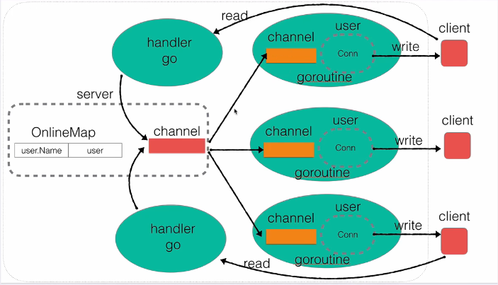

# GoLang-IM-System
Easy Realize Golang Instant Messaging System

## v0.2
Add user login and server broadcast: 

\+ user.go 

/ server.go

## v0.4

/ user.go , server.go

## start program
go run main.go  跑服务器

go build -o client client.go  
./client 跑客户端

